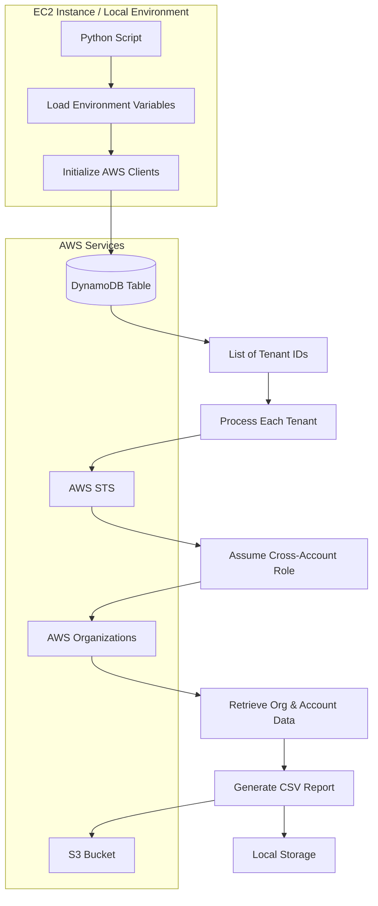
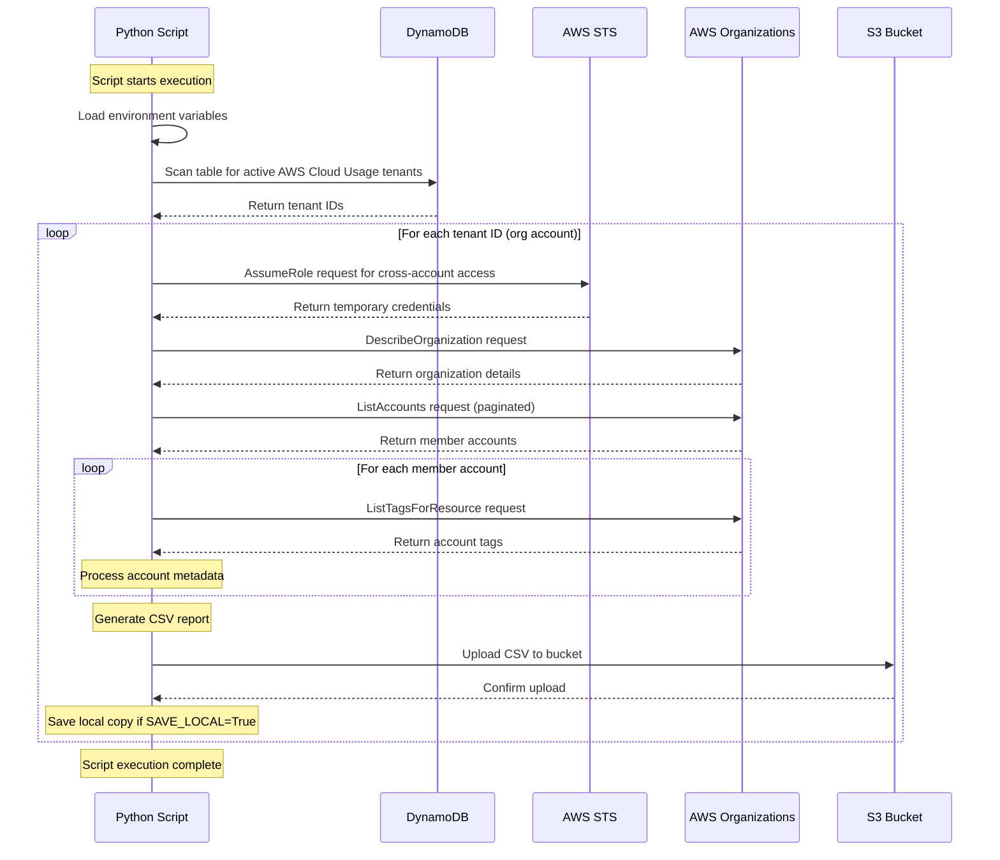
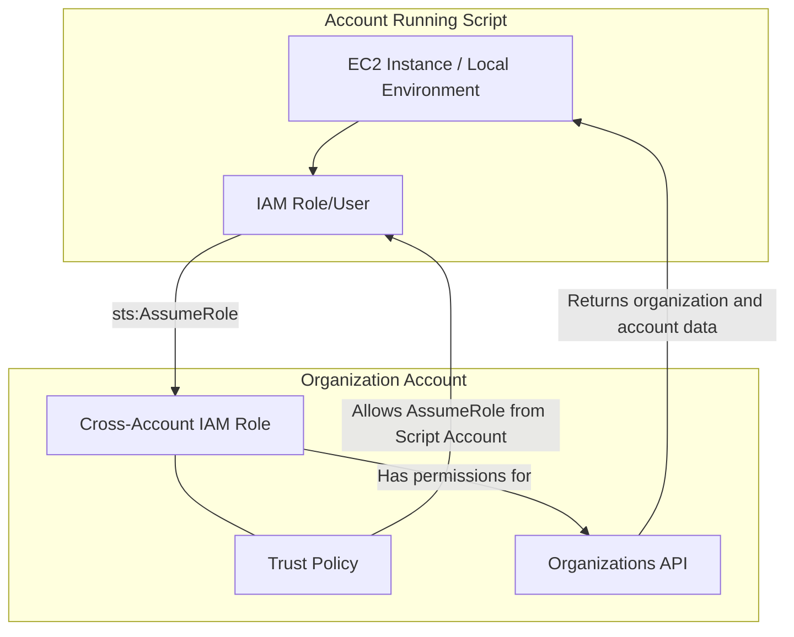
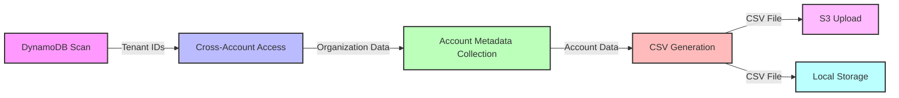

# AWS Organization Account Metadata Collection Flow Diagram

This document provides a detailed visual representation of how the `ec2_tc_script_save_local.py` script interacts with various AWS services to collect and process organization account metadata.

## High-Level Architecture



## Detailed Process Flow



## Cross-Account Access Pattern



## Data Flow and Processing



## IAM Permission Flow

```mermaid
graph TD
    subgraph "Script Execution Role"
        A[IAM Role/User Running Script]
        B["dynamodb:Scan Permission"]
        C["sts:AssumeRole Permission"]
        D["s3:PutObject Permission"]
    end
    
    subgraph "Cross-Account Role in Each Org Account"
        E[IAM Role with Name from CROSS_ACCOUNT_ROLE_NAME]
        F["organizations:DescribeOrganization Permission"]
        G["organizations:ListAccounts Permission"]
        H["organizations:ListTagsForResource Permission"]
        I["Trust Policy Allowing Script Role"]
    end
    
    A --- B
    A --- C
    A --- D
    E --- F
    E --- G
    E --- H
    E --- I
    C -->|"Allows assuming"| E
    I -->|"Trusts"| A
