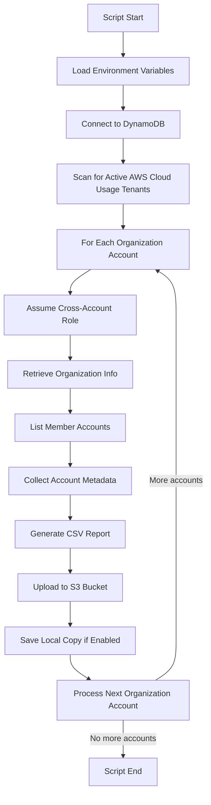

# AWS Organization Account Metadata Collection Script

## Overview

This Python script (`ec2_tc_script_save_local.py`) is designed to collect metadata from AWS Organization accounts and their member accounts. It performs the following operations:

1. Scans a DynamoDB table to identify active AWS Cloud Usage tenants
2. For each organization account:
   - Assumes a cross-account IAM role to access the organization
   - Retrieves organization information and all member accounts
   - Collects metadata for each account (ID, name, org ID, tags, etc.)
   - Creates a CSV report with this information
   - Uploads the report to an S3 bucket
   - Optionally saves a local copy

The script is intended to run on an EC2 instance or locally, and it uses environment variables for configuration.

## Prerequisites

### Environment Variables

The script requires the following environment variables to be set in a `.env` file:

```
OUTPUT_BUCKET=your-s3-bucket-name
DYNAMO_TABLE_NAME=your-dynamodb-table-name
CROSS_ACCOUNT_ROLE_NAME=your-cross-account-role-name
```

### Python Dependencies

Install the required Python packages:

```bash
pip install boto3 python-dotenv
```

### AWS IAM Permissions

#### For the EC2 Instance or Local Execution Role

The IAM role or user running the script needs the following permissions:

1. **DynamoDB Permissions**:
   - `dynamodb:Scan` on the specified DynamoDB table

2. **STS Permissions**:
   - `sts:AssumeRole` to assume the cross-account role in organization accounts

3. **S3 Permissions**:
   - `s3:PutObject` on the specified S3 bucket

Example IAM Policy:

```json
{
    "Version": "2012-10-17",
    "Statement": [
        {
            "Effect": "Allow",
            "Action": [
                "dynamodb:Scan"
            ],
            "Resource": "arn:aws:dynamodb:us-east-1:*:table/YOUR_DYNAMO_TABLE_NAME"
        },
        {
            "Effect": "Allow",
            "Action": [
                "sts:AssumeRole"
            ],
            "Resource": "arn:aws:iam::*:role/YOUR_CROSS_ACCOUNT_ROLE_NAME"
        },
        {
            "Effect": "Allow",
            "Action": [
                "s3:PutObject"
            ],
            "Resource": "arn:aws:s3:::YOUR_S3_BUCKET_NAME/*"
        }
    ]
}
```

#### For the Cross-Account Role in Each Organization Account

Each organization account must have a role with the name specified in `CROSS_ACCOUNT_ROLE_NAME` that has the following permissions:

1. **Organizations Permissions**:
   - `organizations:DescribeOrganization`
   - `organizations:ListAccounts`
   - `organizations:ListTagsForResource`

2. **STS Permissions**:
   - `sts:GetCallerIdentity`

3. **Account Permissions**:
   - `account:GetRegions`

Example IAM Policy for the Cross-Account Role:

```json
{
    "Version": "2012-10-17",
    "Statement": [
        {
            "Effect": "Allow",
            "Action": [
                "organizations:DescribeOrganization",
                "organizations:ListAccounts",
                "organizations:ListTagsForResource"
            ],
            "Resource": "*"
        },
        {
            "Effect": "Allow",
            "Action": [
                "sts:GetCallerIdentity",
                "account:GetRegions"
            ],
            "Resource": "*"
        }
    ]
}
```

### Trust Policy for Cross-Account Role

Each organization account must have a trust policy that allows the EC2 instance or local execution role to assume the cross-account role:

```json
{
    "Version": "2012-10-17",
    "Statement": [
        {
            "Effect": "Allow",
            "Principal": {
                "AWS": "arn:aws:iam::ACCOUNT_ID_RUNNING_SCRIPT:role/ROLE_NAME_RUNNING_SCRIPT"
            },
            "Action": "sts:AssumeRole",
            "Condition": {}
        }
    ]
}
```

Replace `ACCOUNT_ID_RUNNING_SCRIPT` with the AWS account ID where the script is running, and `ROLE_NAME_RUNNING_SCRIPT` with the role name that is executing the script.

## Execution

Run the script using Python:

```bash
python ec2_tc_script_save_local.py
```

By default, the script will:
1. Save CSV reports to the specified S3 bucket
2. Save local copies of the reports to `~/aws-org-scripts-outputs/`

## Script Workflow

The script follows this workflow:

1. Loads environment variables from a `.env` file
2. Connects to DynamoDB and scans for active AWS Cloud Usage tenants
3. For each organization account found:
   - Assumes the cross-account role in the organization account
   - Retrieves organization information
   - Lists all member accounts in the organization
   - Collects metadata for each account, including:
     - Account ID
     - Account Name
     - Organization ID
     - Tenant Name (Management Account ID)
     - Cloud Service Provider (AWS)
     - Account Status
     - Environment tag (if available)
     - Aide-ID tag (if available)
   - Creates a CSV report with the collected metadata
   - Uploads the CSV to the specified S3 bucket
   - Optionally saves a local copy of the CSV

## Flow Diagram



## Output Format

The script generates CSV files with the following naming convention:

```
aws-{org_account_id}-account-metadata-report-{timestamp}.csv
```

Each CSV contains the following columns:
- Account_Id
- Account_Name
- Org_ID
- Tenant_Name
- CSP
- Billing_Account_State
- Region_Group
- Regions
- Tenant_ID
- Environment
- Aide_ID

## Region Detection Feature

### Overview

The script now includes region detection functionality that adds two new columns to the CSV report:
- **Region_Group**: The region group classification (US, UK, EU, BR, or "multi")
- **Regions**: Comma-separated list of active regions

### How It Works

The region detection uses the AWS Resource Groups Tagging API to:

1. **Query Tagged Resources**: Uses `resourcegroupstaggingapi.get_resources()` to retrieve all tagged resources across the account
2. **Extract Regions**: Parses each resource's ARN to extract the region (format: `arn:aws:service:region:account-id:resource`)
3. **Map to Region Groups**: Maps active regions to predefined region groups:
   - **US**: us-east-1, us-east-2, us-west-1, us-west-2
   - **UK**: eu-west-2
   - **EU**: eu-north-1, eu-west-1
   - **BR**: sa-east-1
4. **Determine Classification**:
   - Single region group active → Returns group name (e.g., "US")
   - Multiple region groups active → Returns "multi"
   - No regions in defined groups → Returns empty string

### Resource Types Queried

The API queries **all tagged AWS resources** including:
- EC2 instances, volumes, VPCs
- S3 buckets
- RDS databases
- Lambda functions
- Load balancers
- CloudFormation stacks
- IAM roles
- And many more AWS services that support tagging

**Important**: Only resources with tags are detected. Untagged resources won't contribute to region detection.

### Performance Impact

#### Timing Considerations
- **Small accounts** (few hundred tagged resources): 10-30 seconds per account
- **Medium accounts** (thousands of tagged resources): 1-5 minutes per account
- **Large accounts** (tens of thousands of tagged resources): 5-15+ minutes per account

#### Total Script Runtime
For organizations with multiple accounts, the total runtime can be significant:
- 10 accounts × 2 minutes average = 20+ minutes
- 50 accounts × 2 minutes average = 100+ minutes

#### Factors Affecting Performance
- Number of tagged resources per account
- API pagination (50 resources per page)
- Network latency
- AWS API rate limiting

### Required Additional Permissions

The cross-account role in each organization account needs additional permissions for region detection:

```json
{
    "Effect": "Allow",
    "Action": [
        "tag:GetResources"
    ],
    "Resource": "*"
}
```

### Potential Optimizations (Future Considerations)

If performance becomes an issue, consider these optimizations:

1. **Parallel Processing**: Query multiple accounts simultaneously using threading or multiprocessing
2. **Caching Strategy**: Store region data with TTL and refresh periodically rather than querying every run
3. **Sampling Approach**: Query only a subset of resources for region detection instead of all tagged resources
4. **Alternative Data Sources**: 
   - Use AWS Config for resource inventory
   - Leverage CloudTrail for region activity detection
   - Query specific high-volume services (EC2, RDS) instead of all resources
5. **Timeout Handling**: Implement reasonable timeouts to prevent hanging on problematic accounts
6. **Incremental Updates**: Only re-scan accounts that have changed since last run
7. **Resource Filtering**: Focus on specific resource types that are most indicative of regional activity

### Monitoring and Troubleshooting

The script provides detailed logging for region detection:
- Shows active regions detected for each account
- Logs warnings for accounts where region detection fails
- Reports timing information for performance monitoring

Common issues:
- **No regions detected**: Account may have no tagged resources
- **Slow performance**: Account has many tagged resources; consider optimization strategies
- **Permission errors**: Ensure the cross-account role has `tag:GetResources` permission

## Troubleshooting

Common issues and their solutions:

1. **Missing Environment Variables**: Ensure all required environment variables are set in the `.env` file.
2. **IAM Permission Issues**: Verify that the IAM roles have the correct permissions as described in the Prerequisites section.
3. **Cross-Account Role Not Found**: Ensure the cross-account role exists in each organization account with the correct name and trust policy.
4. **S3 Bucket Access Denied**: Verify that the script has permission to upload objects to the specified S3 bucket.
5. **Region Detection Failures**: Ensure the cross-account role has `tag:GetResources` permission for the Resource Groups Tagging API.
